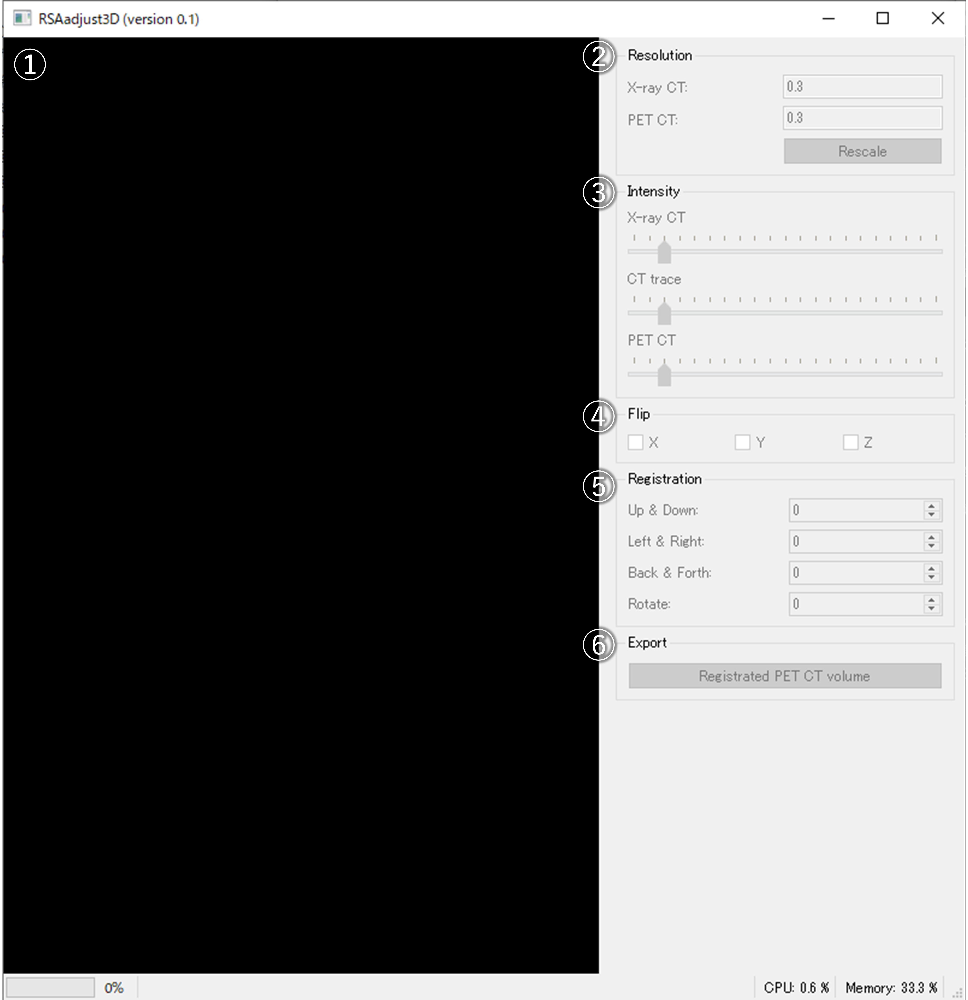

# RSAadjust3D: a position adjustment software for X-ray CT and PET-CT RSA data


## introduction

RSAadjust3D is a Python program for registration of two 3D volume data, X-ray CT volume and PET-CT volume. With a few simple mouse clicks, you can scale and position your images in minutes. With a simple mouse operation, a PET-CT image can be rescaled and overlaid on an X-ray CT image in a few minutes.

## system requirements

Version 3.6 or higher versions of Python should be installed. This software depends on the following packages:

- PyQt5
- pyopengl
- pyqtgraph
- psutil
- numpy
- scikit-image
- coloredlogs

The following command will install the necessary packages.

```
pip install -U pip
pip install -r requirements.txt
```

The confirmed operating environments are shown below:

Environment 1:

- CPU: Intel<sup>(R)</sup> Core<sup>TM</sup> i7-11700 CPU
- Memory: 32 GB
- Windows 10 professional
- NVIDEA GeForce RTX<sup>TM</sup> 3060 12GB GDDR6
- Python (3.9.5) on miniconda
   - PyQt5 (5.15.4)
   - pyopengl (0.12.2)
   - pyqtgraph (0.12.2)
   - psutil (5.8.0)
   - numpy (1.21.2)
   - scikit-image (0.18.3)

## installation

Run the following commands:

```
git clone https://github.com/st707311g/RSAadjust3D.git
cd RSAadjust3D
```

## how to use

### files

X-ray CT volume filtered with [RSAvis3D](https://github.com/st707311g/RSAvis3D.git), RSA vector data created by [RSAtrace3D](https://github.com/st707311g/RSAtrace3D.git), and PET-CT volume must be stored in single directory.

- DIR/
   - [volume_name]/ <span style="color: gray; "><- RSAvis3D volume</span>
   - [volume_name]_PET/ <span style="color: gray; "><- PET-CT volume</span>
   - [volume_name].rinfo <span style="color: gray; "><- RSAtrace3D vector data</span>

Move to the RSAadjust3D root directory which contains `__main__.py` file, and run the following command:
```
pyhton .
```

If environment is correctly installed, the main window will appear. 

 

1. 3D view of RSAvis3D volume, RSA vector trace, and PET-CT volume.
2. Resolution for RSAvis3D and PET-CT volumes. The `Rescale` button rescales the PET-CT volume.
3. Intensity of RSAvis3D volume, RSA vector trace, and PET-CT volume. Strong on the right, weak on the left.
4. Flip the PET-CT volume.
5. Shift and rotate setting for the PET-CT volume.
6. Export registrated PET-CT volume. The file will be saved in a directory with the suffix "_registrated".

## version policy

Version information consists of major and minor versions (major.minor). When the major version increases by one, it is no longer compatible with the original version. When the minor version invreases by one, compatibility will be maintained. Revisions that do not affect functionality, such as bug fixes and design changes, will not affect the version number.

## citation

We are currently preparing a paper on this software. You are free to use this software according to the license, but do not publish the results of using this software before our preparing paper has been published.

## license

NARO NON-COMMERCIAL LICENSE AGREEMENT Version 1.0

This license is for 'Non-Commercial' use of software for `RSAadjust3D`

* Scientific use of `RSAadjust3D` is permitted free of charge.
* Modification of `RSAadjust3D` is only permitted to the person of downloaded and his/her colleagues.
* The National Agriculture and Food Research Organization (hereinafter referred to as NARO) does not guarantee that defects, errors or malfunction will not occur with respect to `RSAadjust3D`.
* NARO shall not be responsible or liable for any damage or loss caused or be alleged to be caused, directly or indirectly, by the download and use of `RSAadjust3D`.
* NARO shall not be obligated to correct or repair the program regardless of the extent, even if there are any defects of malfunctions in `RSAadjust3D`.
* The copyright and all other rights of `RSAadjust3D` belong to NARO.
* Selling, renting, re-use of license, or use for business purposes etc. of `RSAadjust3D` shall not be allowed. For commercial use, license of commercial use is required. Inquiries for such commercial license are directed to NARO.
* The `RSAadjust3D` may be changed, or the distribution maybe canceled without advance notification.
*In case the result obtained using `RSAadjust3D` in used for publication in academic journals etc., please refer the publication of `RSAadjust3D` and/or acknowledge the use of `RSAadjust3D` in the publication.

Copyright (C) 2021 National Agriculture and Food Research Organization. All rights reserved.

## update history

* version 0.1 (September 29, 2021)
  * initial version uploaded
  
